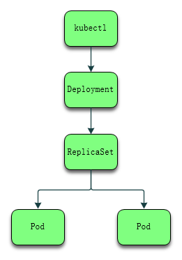

## [Kubernetes-doc](https://jueee.github.io/Kubernetes-doc/)

### 安装资料

- [安装 kubectl 客户端](install-kubernetes-kubectl.md)
- [通过 Minikube 安装 Kubernetes](install-kubernetes-minikube.md)
- [通过 kubeadm 安装 kubernetes](install-kubernetes-kubeadm.md)
- [安装 Prometheus](install-prometheus.md)

### 学习资料：

- [学习 Kubernetes 基础知识](docs/learn-kubernetes-basics.md)
- [通过命令行部署 nginx 镜像](docs/learn-nginx-command.md)
- [通过配置文件部署 nginx 镜像](docs/learn-nginx-yml.md)

### 组件相关

- [yml 配置文件相关](docs/docs-kubernetes-yml.md)
- [namespaces 相关](docs/docs-kubernetes-namespaces.md)
- [nfs 相关](docs/docs-kubernetes-nfs.md)
- [node 相关](docs/docs-kubernetes-node.md)
- [secret 相关](docs/docs-kubernetes-secret.md)
- [StatefulSet 相关](docs/docs-kubernetes-StatefulSet.md)
- [taint 相关](docs/docs-kubernetes-taint.md)

### 部署相关

- [部署 MySQL](deploy/deploy-mysql.md)
- [部署 elasticsearch](deploy/deploy-elasticsearch.md)

### 问题解决

- [pod 间通过 svc 通信](docs/question-pod-ping-servicename.md)
- [其他问题汇总](docs/question-other.md)

## Helm 相关资料

### 安装资料

- [安装 helm 客户端](helm/install-helm.md)
- [安装 helm minio](helm/install-helm-minio.md)

### 学习资料

- [kubernetes helm 相关文档](helm/docs-helm.md)
- [Kubernetes helm 基础知识](helm/docs-helm-basics.md)

### 部署相关

- [使用Helm部署metrics-server](helm/install-helm-metrics-server.md)

## k8s 组件关系总结

1. 用户通过 kubectl 创建 Deployment 。
2. Deployment 创建 ReplicaSet 。
3. ReplicaSet 创建 Pod 。

