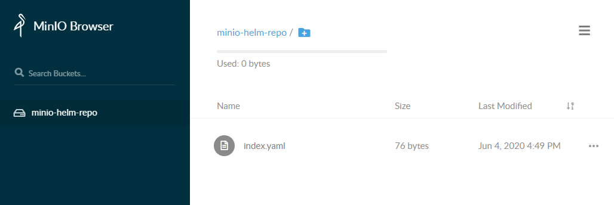

## 安装 helm minio

### minio介绍

MinIO 是一个基于Apache License  v2.0开源协议的对象存储服务。它兼容亚马逊S3云存储服务接口，非常适合于存储大容量非结构化的数据，例如图片、视频、日志文件、备份数据和容器/虚拟机镜像等，而一个对象文件可以是任意大小，从几kb到最大5T不等。

MinIO是一个非常轻量的服务,可以很简单的和其他应用的结合，类似 NodeJS, Redis 或者 MySQL。

GitHub：https://github.com/minio/minio

Docker 文档：https://docs.min.io/docs/minio-docker-quickstart-guide

### 安装minio服务端

#### 使用容器安装服务端

```shell
$ docker pull minio/minio
$ docker run -p 9000:9000 --name minio -v /mnt/data/3/miniodata:/data -d minio/minio server /data
```

查看日志

```
$ docker logs minio
Endpoint:  http://172.18.0.3:9000  http://127.0.0.1:9000

Browser Access:
   http://172.18.0.3:9000  http://127.0.0.1:9000

Object API (Amazon S3 compatible):
   Go:         https://docs.min.io/docs/golang-client-quickstart-guide
   Java:       https://docs.min.io/docs/java-client-quickstart-guide
   Python:     https://docs.min.io/docs/python-client-quickstart-guide
   JavaScript: https://docs.min.io/docs/javascript-client-quickstart-guide
   .NET:       https://docs.min.io/docs/dotnet-client-quickstart-guide
Detected default credentials 'minioadmin:minioadmin', please change the credentials immediately using 'MINIO_ACCESS_KEY' and 'MINIO_SECRET_KEY'
```

可访问 `http://127.0.0.1:9000` 进行登录，初始用户名密码为：`minioadmin/minioadmin`

#### 使用二进制安装服务端

```
wget  https://dl.min.io/server/minio/release/linux-amd64/minio
chmod +x minio
mkdir  -p  /chart
./minio server /chart
```

### 安装minio客户端

#### 使用容器安装客户端

```
$ docker pull minio/mc
$ docker run --name minio-client -d minio/mc ls play
```

#### 使用二进制安装客户端

```
$ wget https://dl.min.io/client/mc/release/linux-amd64/mc
$ chmod +x mc
$ sudo mv mc /usr/local/bin
```

#### 连接至服务端

```
$ mc config host add myminio http://127.0.0.1:9000 minioadmin minioadmin
Added `myminio` successfully.
```

#### mc的shell使用别名

```
ls=mc ls
cp=mc cp
cat=mc cat
mkdir=mc mb
pipe=mc pipe
find=mc find
```

### 上传文件到仓库

#### 创建bucket

```
$ mc mb myminio/minio-helm-repo
Bucket created successfully `myminio/minio-helm-repo`.
```

#### 设置bucket和objects匿名访问

```
$ mc policy set download myminio/minio-helm-repo
Access permission for `myminio/minio-helm-repo` is set to `download`
```

#### helm创建index.yaml文件

```
$ helm repo index .

$ ls
index.yaml

$ cat index.yaml
apiVersion: v1
entries: {}
generated: "2020-06-04T16:49:14.681346504+08:00"
```

#### 将index.yaml文件推送到backet中去

```
$ mc cp index.yaml  myminio/minio-helm-repo
index.yaml:                          76 B / 76 B ┃▓▓▓▓▓▓▓▓▓▓▓▓▓▓┃ 19.28 KiB/s 0s
```

#### helm连接私仓

```
$ helm repo add manti http://127.0.0.1:9000/minio-helm-repo
$ helm repo update
```

#### 查看repo

```
$ helm repo list
NAME            URL
stable          http://mirror.azure.cn/kubernetes/charts
aliyun          https://kubernetes.oss-cn-hangzhou.aliyuncs.com/charts
bitnami         https://charts.bitnami.com/bitnami
manti           http://127.0.0.1:9000/minio-helm-repo
```

#### 查看repo中的文件

```
$ mc ls myminio/minio-helm-repo
[2020-06-04 16:49:40 CST]     76B index.yaml
```

#### 登录Web查看



### 将 Helm 项目上传到仓库

#### 上传

理论：其实所有仓库的本质都是上传chart压缩包和它的描述信息 index.yaml

1. chart打包

   ```
   $ helm package .
   ```

2. 创建index.html。

   Helm 会扫描myrepo目录中的所有tgz包并生成index.yaml。

   --url 指定的是新仓库的访问路径。新生成的index.yaml记录了当前仓库中所有 chart 的信息

   ```
   $ helm repo index . --url http://127.0.0.1:9000/minio-helm-repo
   ```

3. 上传index与压缩包

   ```
   $ mc cp index.yaml myminio/minio-helm-repo
   $ mc cp *.tgz myminio/minio-helm-repo
   ```

#### 验证

每次提交完包，注意 update 一下 repo

```
$ helm repo update
$ helm search repo manti
NAME            CHART VERSION   APP VERSION     DESCRIPTION
manti/phishing  0.0.1
```

