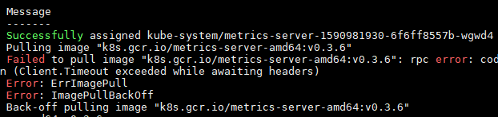

## 使用Helm部署metrics-server

GitHub

> https://github.com/kubernetes-sigs/metrics-server

Metrics-Server是集群核心监控数据的聚合器。通俗地说，它存储了集群中各节点的监控数据，并且提供了API以供分析和使用。

### 安装 metrics-server

helm添加repo方式：

```shell
$ helm repo add stable http://mirror.azure.cn/kubernetes/charts
```

编写 metrics-server.yaml：

```yaml
args:
- --logtostderr
- --kubelet-insecure-tls
- --kubelet-preferred-address-types=InternalIP
```

安装：

```shell
$ helm install metrics stable/metrics-server -n metrics-server --namespace kube-system -f metrics-server.yaml
```

### 手动下载镜像

可 `k get pod -n kube-system` 查看运行状态，如果一直 `ImagePullBackOff`，可查看 `k describe pod`：



若默认镜像 `k8s.gcr.io/metrics-server-amd64:v0.3.6` 无法下载，则需手动更新镜像。

下载镜像：

```
$ docker pull registry.cn-hangzhou.aliyuncs.com/google_containers/metrics-server-amd64:v0.3.6
$ docker tag registry.cn-hangzhou.aliyuncs.com/google_containers/metrics-server-amd64:v0.3.6 k8s.gcr.io/metrics-server-amd64:v0.3.6
$ docker rmi registry.cn-hangzhou.aliyuncs.com/google_containers/metrics-server-amd64:v0.3.6
```

再次安装即可。

### 验证 

```shell
$ kubectl top node
NAME              CPU(cores)   CPU%   MEMORY(bytes)   MEMORY%
XXXXX		      702m         1%     41375Mi         16%
```


```shell
$ kubectl top pod --all-namespaces
NAMESPACE              NAME                                    CPU(cores)   MEMORY(bytes)
kube-system            coredns-6955765f44-8sk78                2m           12Mi
kube-system            coredns-6955765f44-rh6v4                2m           12Mi
kube-system            etcd-dm33.jd.163.org                    17m          54Mi
```

