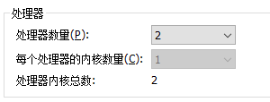
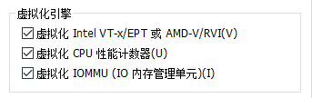

## 通过 Minikube 安装 Kubernetes

Minikube是一个工具，可以在本地快速运行一个单点的Kubernetes，仅用于尝试Kubernetes或日常开发的用户使用。

#### 相关资料

Git 地址

> https://github.com/AliyunContainerService/minikube

安装文档

> https://kubernetes.io/zh/docs/setup/learning-environment/minikube/

安装配置

> https://minikube.sigs.k8s.io/docs/start/

#### 安装 Minikube

```shell
$ curl -LO https://storage.googleapis.com/minikube/releases/latest/minikube_latest_amd64.deb
$ sudo dpkg -i minikube_latest_amd64.deb
```

#### 验证 Minikube

```shell
$ minikube version
minikube version: v1.10.1
commit: 63ab801ac27e5742ae442ce36dff7877dcccb278
```

#### 启动 Minikube

启动Minikube并创建集群：

```shell
$ minikube start
```

启动时打印日志

```shell
$ minikube start --alsologtostderr -v=1
```

使用docker驱动程序启动集群：

```shell
$ minikube start --driver=docker
```

要将docker设置为默认驱动程序：

```shell
$ minikube config set driver docker
```

#### 启动说明

```shell
$ minikube start
* minikube v1.10.1 on Debian 10.2
* Using the docker driver based on user configuration
* Starting control plane node minikube in cluster minikube
* Creating docker container (CPUs=2, Memory=1970MB) ...
* Preparing Kubernetes v1.18.2 on Docker 19.03.2 ...
  - kubeadm.pod-network-cidr=10.244.0.0/16
* Verifying Kubernetes components...
* Enabled addons: default-storageclass, storage-provisioner
* Done! kubectl is now configured to use "minikube"
* For best results, install kubectl: https://kubernetes.io/docs/tasks/tools/install-kubectl/
```

可以看到，minikube start主要做了这些事：

1. 创建了名为minikube的虚拟机，并在虚拟机中安装了Docker容器运行时。（实际就是Docker-machine）
2. 下载了Kubeadm与Kubelet工具
3. 通过Kubeadm部署Kubernetes集群
4. 进行各组件间访问授权、健康检查等工作
5. 在用户操作系统安装并配置kubectl

#### 基本操作

进入部署的虚拟机中：

```shell
$ minikube ssh
```

日志

```shell
$ minikube logs
```

查看minikube安装是否成功，执行以下命令：

```shell
$ minikube status
minikube
type: Control Plane
host: Running
kubelet: Running
apiserver: Running
kubeconfig: Configured
```

#### 安装客户端kubectl

参考 [install-kubernetes-kubectl.md](install-kubernetes-kubectl.md)


#### 安装dashboard

```shell
$ minikube dashboard
```

为 dashboard 添加外部访问代理,此处的 IP 为本地系统 IP：

```shell
$ kubectl proxy --port=8001 --address='192.168.31.130' --accept-hosts='^.*' &
```

访问Web

> http://192.168.31.130:8001/api/v1/namespaces/kubernetes-dashboard/services/http:kubernetes-dashboard:/proxy/#/node?namespace=default

#### 问题解决

1、服务器内核不足

> docker: Error response from daemon: Range of CPUs is from 0.01 to 1.00, as there are only 1 CPUs available.



2、docker驱动程序无法获取网桥

> E0519 20:00:52.549177   49833 start.go:95] Unable to get host IP: inspect IP bridge network "fbef452a486e\naf41a41ae7ef".: docker inspect --format "{{(index .IPAM.Config 0).Gateway}}" fbef452a486e

解决方案：要使节点离开Swarm并清理未使用的网络，则minikube会正确启动。

参考资料：https://github.com/kubernetes/minikube/issues/8131

```
docker swarm leave --force
docker network prune
```

3、虚拟机开启cpu虚拟化



4、无法拉取镜像

```
$ minikube ssh
docker@minikube:~$ docker login xxx
Username: xxx
Password:
```

