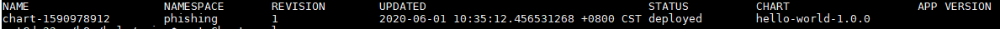

## 学习 Kubernetes helm 基础知识

### 目录结构

```shell
$ tree
.
├── Chart.yaml
├── templates
│   ├── deployment.yaml
│   └── service.yaml
└── values.yaml
```

- `Chart.yaml`： Helm 基本配置，用于描述Chart的基本信息，包括名称版本等
- `values.yaml`：Chart 的默认配置文件，可配置变量用于 templates 文件夹下的资源清单
- `templates/` ：存放当前 Chart 依赖的其它 Chart 的说明文件。

### 无配置文件

#### 文件配置

`Chart.yaml`

```yaml
name: hello-world
version: 1.0.0
```

`templates/deployment.yaml`

```yaml
apiVersion: apps/v1
kind: Deployment
metadata:
  name: hello-world
spec:
  replicas: 1
  selector:
    matchLabels:
      app: hello-world
  template:
    metadata:
      labels:
        app: hello-world
    spec:
      containers:
      - name: hello-world
        image: nginx:latest
        ports:
        - containerPort: 80
          protocol: TCP
```

`templates/service.yaml`

```yaml
apiVersion: v1
kind: Service
metadata:
  name: hello-world
spec:
  type: NodePort
  ports:
  - port: 80
    targetPort: 80
    protocol: TCP
  selector:
    app: hello-world
```

#### 创建 Release

```shell
$ helm install . --generate-name
NAME: chart-1590978912
LAST DEPLOYED: Mon Jun  1 10:35:12 2020
NAMESPACE: phishing
STATUS: deployed
REVISION: 1
TEST SUITE: None

$ helm install nginx .
NAME: nginx
LAST DEPLOYED: Mon Jun  1 11:12:38 2020
NAMESPACE: phishing
STATUS: deployed
REVISION: 1
TEST SUITE: None
```

- 在 Helm 2 中，如果没有指定 Release 的名称，则会自动随机生成一个名称。但是在 Helm 3 中，则必须主动指定名称，或者增加 --generate-name 的参数。

### 有配置文件

#### 文件配置

`values.yaml`

```yaml
image:
  repository: nginx
  tag: 'latest'
```

`templates/deployment.yaml`

```yaml
image: {{ .Values.image.repository }}:{{ .Values.image.tag }}
```

### 查看 Release

列出已经部署的 Release

```shell
$ helm ls
```



查询一个特定的 Release 的状态

```yaml
$ helm status chart-1590978912
NAME: chart-1590978912
LAST DEPLOYED: Mon Jun  1 10:35:12 2020
NAMESPACE: phishing
STATUS: deployed
REVISION: 1
TEST SUITE: None
```

移除所有与这个 Release 相关的 Kubernetes 资源

```shell
$ helm delete chart-1590978912
release "chart-1590978912" uninstalled
```

### Debug

使用模板动态生成K8s资源清单，非常需要能提前预览生成的结果。

使用--dry-run --debug 选项来打印出生成的清单文件内容，而不执行部署

```
$ helm install nginx . --dry-run --debug --set image.tag=latest
```

