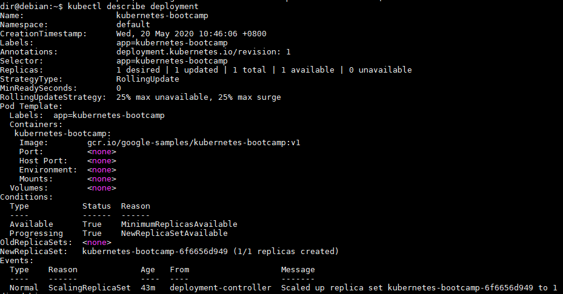
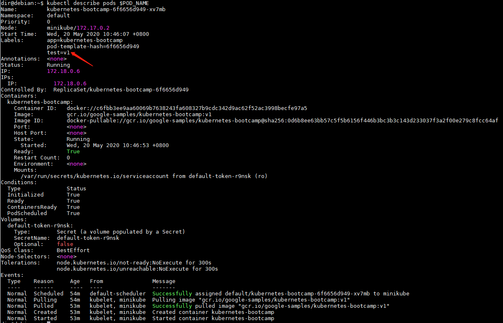
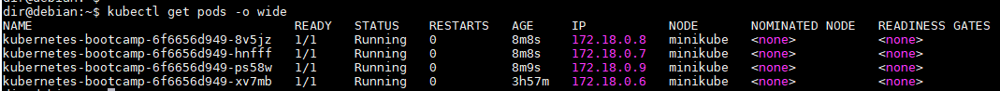
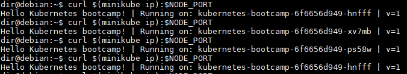

## 学习 Kubernetes 基础知识

参考资料

> https://kubernetes.io/docs/tutorials/kubernetes-basics/

### 创建集群

通过运行minikube version命令，检查是否已正确安装：

```shell
$ minikube version
minikube version: v1.10.1
commit: 63ab801ac27e5742ae442ce36dff7877dcccb278
```

通过运行minikube start命令来启动集群：

```shell
$ minikube start
* minikube v1.10.1 on Debian 10.2
* Using the docker driver based on existing profile
* Starting control plane node minikube in cluster minikube
* Restarting existing docker container for "minikube" ...
* Preparing Kubernetes v1.18.2 on Docker 19.03.2 ...
  - kubeadm.pod-network-cidr=10.244.0.0/16
* Enabled addons: dashboard, default-storageclass, storage-provisioner
* Done! kubectl is now configured to use "minikube"
```

检查是否安装了kubectl，运行kubectl version命令：

```shell
$ kubectl version
Client Version: version.Info{Major:"1", Minor:"18", GitVersion:"v1.18.2", GitCommit:"52c56ce7a8272c798dbc29846288d7cd9fbae032", GitTreeState:"clean", BuildDate:"2020-04-16T11:56:40Z", GoVersion:"go1.13.9", Compiler:"gc", Platform:"linux/amd64"}
Server Version: version.Info{Major:"1", Minor:"18", GitVersion:"v1.18.2", GitCommit:"52c56ce7a8272c798dbc29846288d7cd9fbae032", GitTreeState:"clean", BuildDate:"2020-04-16T11:48:36Z", GoVersion:"go1.13.9", Compiler:"gc", Platform:"linux/amd64"}
```

查看集群的详细信息

```shell
$ kubectl cluster-info dump // 集群详细信息
$ kubectl cluster-info // 查看集群信息
Kubernetes master is running at https://172.17.0.2:8443
KubeDNS is running at https://172.17.0.2:8443/api/v1/namespaces/kube-system/services/kube-dns:dns/proxy

To further debug and diagnose cluster problems, use 'kubectl cluster-info dump'.
```

查看集群中的节点

```shell
$ kubectl get nodes
NAME       STATUS   ROLES    AGE   VERSION
minikube   Ready    master   14h   v1.18.2
```

### 部署应用

#### 部署应用

部署我们的第一个应用程序

```shell
$ kubectl create deployment kubernetes-bootcamp --image=gcr.io/google-samples/kubernetes-bootcamp:v1
deployment.apps/kubernetes-bootcamp created
```

列出部署的应用程序

```shell
$ kubectl get deployments
NAME                  READY   UP-TO-DATE   AVAILABLE   AGE
kubernetes-bootcamp   1/1     1            1           73s
```

在另一个终端中运行代理，该代理会将通信转发到群集范围的专用网络中。 

可以通过按Ctrl-C终止代理，并且在运行时不显示任何输出。

```shell
$ kubectl proxy
Starting to serve on 127.0.0.1:8001

```

可以使用curl命令直接通过API查询版本：

```shell
$ curl http://localhost:8001/version
{
  "major": "1",
  "minor": "18",
  "gitVersion": "v1.18.2",
  "gitCommit": "52c56ce7a8272c798dbc29846288d7cd9fbae032",
  "gitTreeState": "clean",
  "buildDate": "2020-04-16T11:48:36Z",
  "goVersion": "go1.13.9",
  "compiler": "gc",
  "platform": "linux/amd64"
}
```

API服务器将基于容器名称自动为每个容器创建一个端点，该端点也可以通过代理进行访问。

首先，我们需要获取Pod名称，然后将其存储在环境变量POD_NAME中：

```shell
$ export POD_NAME=$(kubectl get pods -o go-template --template '{{range .items}}{{.metadata.name}}{{"\n"}}{{end}}')
dir@debian:~$ echo Name of the Pod: $POD_NAME
Name of the Pod: kubernetes-bootcamp-6f6656d949-xv7mb
```

为了不使用代理就可以访问新部署，需要一个服务，这将在接下来的模块中进行解释。

#### 删除应用

```shell
$ kubectl delete deployment kubernetes-bootcamp
deployment.apps "kubernetes-bootcamp" deleted
```

### 了解应用

#### 检查应用程序配置

使用kubectl get命令并查找现有的Pod：

**pod**:  紧密相关的一组容器放到一个Pod中，同一个Pod中的容器共享IP地址和Port空间。

```shell
$ kubectl get pods
NAME                                   READY   STATUS    RESTARTS   AGE
kubernetes-bootcamp-6f6656d949-xv7mb   1/1     Running   0          12m
```

查看该Pod中有哪些容器以及用于构建这些容器的镜像

describe命令可用于获取有关大多数kubernetes原语的详细信息：节点，pod，部署。

```shell
$ kubectl describe pods
```


获取Pod名称并将其存储在POD_NAME环境变量中

```
$ export POD_NAME=$(kubectl get pods -o go-template --template '{{range .items}}{{.metadata.name}}{{"\n"}}{{end}}')
$ echo Name of the Pod: $POD_NAME
Name of the Pod: kubernetes-bootcamp-6f6656d949-xv7mb
```

#### 查看容器日志

使用kubectl logs命令检索容器的日志：

```shell
$ kubectl logs $POD_NAME
Kubernetes Bootcamp App Started At: 2020-05-20T02:46:53.937Z | Running On:  kubernetes-bootcamp-6f6656d949-xv7mb
```

#### 在容器上执行命令

使用exec命令并将Pod的名称用作参数。 让我们列出环境变量：

```shell
$ kubectl exec $POD_NAME -- env
PATH=/usr/local/sbin:/usr/local/bin:/usr/sbin:/usr/bin:/sbin:/bin
HOSTNAME=kubernetes-bootcamp-6f6656d949-xv7mb
KUBERNETES_PORT=tcp://10.96.0.1:443
KUBERNETES_PORT_443_TCP=tcp://10.96.0.1:443
KUBERNETES_PORT_443_TCP_PROTO=tcp
KUBERNETES_PORT_443_TCP_PORT=443
KUBERNETES_PORT_443_TCP_ADDR=10.96.0.1
KUBERNETES_SERVICE_HOST=10.96.0.1
KUBERNETES_SERVICE_PORT=443
KUBERNETES_SERVICE_PORT_HTTPS=443
NPM_CONFIG_LOGLEVEL=info
NODE_VERSION=6.3.1
HOME=/root
```

在Pod的容器中开始bash会话：

```shell
$ kubectl exec -ti $POD_NAME -- bash
root@kubernetes-bootcamp-6f6656d949-xv7mb:/# 
```

通过运行curl命令来检查应用程序是否启动：

```shell
root@kubernetes-bootcamp-6f6656d949-xv7mb:/# curl localhost:8080
Hello Kubernetes bootcamp! | Running on: kubernetes-bootcamp-6f6656d949-xv7mb | v=1
```

### 发布应用程序

#### 创建服务

列出集群中的当前服务：

```shell
$ kubectl get services
NAME         TYPE        CLUSTER-IP   EXTERNAL-IP   PORT(S)   AGE
kubernetes   ClusterIP   10.96.0.1    <none>        443/TCP   15h
```


我们有一个名为kubernetes的服务，它是在minikube启动集群时默认创建的。 

要创建新服务并将其公开给外部流量，我们将使用带有NodePort作为参数的暴露命令。

```shell
$ kubectl expose deployment/kubernetes-bootcamp --type="NodePort" --port 8080
service/kubernetes-bootcamp exposed

$ kubectl get services
NAME                  TYPE        CLUSTER-IP      EXTERNAL-IP   PORT(S)          AGE
kubernetes            ClusterIP   10.96.0.1       <none>        443/TCP          15h
kubernetes-bootcamp   NodePort    10.105.137.43   <none>        8080:31234/TCP   3s
```

为了找出外部打开了哪个端口（通过NodePort选项），我们将运行describe service命令：

```shell
$ kubectl describe services/kubernetes-bootcamp
Name:                     kubernetes-bootcamp
Namespace:                default
Labels:                   app=kubernetes-bootcamp
Annotations:              <none>
Selector:                 app=kubernetes-bootcamp
Type:                     NodePort
IP:                       10.105.137.43
Port:                     <unset>  8080/TCP
TargetPort:               8080/TCP
NodePort:                 <unset>  31234/TCP
Endpoints:                172.18.0.6:8080
Session Affinity:         None
External Traffic Policy:  Cluster
Events:                   <none>
```

创建一个名为NODE_PORT的环境变量，该变量具有分配的Node端口的值：

```shell
$ export NODE_PORT=$(kubectl get services/kubernetes-bootcamp -o go-template='{{(index .spec.ports 0).nodePort}}')
$ echo NODE_PORT=$NODE_PORT
NODE_PORT=31234
```

现在，我们可以使用curl，Node的IP和外部暴露的端口来测试该应用程序是否在群集外部暴露：

```shell
$ curl $(minikube ip):$NODE_PORT
Hello Kubernetes bootcamp! | Running on: kubernetes-bootcamp-6f6656d949-xv7mb | v=1
```

#### 使用标签

部署会自动为我们的Pod创建一个标签。 使用describe deploy命令，您可以看到标签的名称：

```shell
$ kubectl describe deployment
```



使用kubectl get pods命令，并将-l作为参数，然后加上上述 `Labels` 值：

```shell
$ kubectl get pods -l app=kubernetes-bootcamp
NAME                                   READY   STATUS    RESTARTS   AGE
kubernetes-bootcamp-6f6656d949-xv7mb   1/1     Running   0          45m
```

执行相同的操作以列出现有服务：

```shell
$ kubectl get services -l app=kubernetes-bootcamp
NAME                  TYPE       CLUSTER-IP      EXTERNAL-IP   PORT(S)          AGE
kubernetes-bootcamp   NodePort   10.105.137.43   <none>        8080:31234/TCP   10m
```

获取Pod名称，然后将其存储在环境变量POD_NAME中：

```shell
$ export POD_NAME=$(kubectl get pods -o go-template --template '{{range .items}}{{.metadata.name}}{{"\n"}}{{end}}')
$ echo Name of the Pod: $POD_NAME
Name of the Pod: kubernetes-bootcamp-6f6656d949-xv7mb
```


要应用新标签，我们使用label命令，后跟对象类型，对象名称和新标签：

```shell
$ kubectl label pod $POD_NAME test=v1
pod/kubernetes-bootcamp-6f6656d949-xv7mb labeled
```

这将在我们的Pod上添加一个新标签（将应用程序版本固定到Pod），我们可以使用describe pod命令进行检查：



现在我们可以使用新标签查询列表：

```shell
$ kubectl get pods -l test=v1
NAME                                   READY   STATUS    RESTARTS   AGE
kubernetes-bootcamp-6f6656d949-xv7mb   1/1     Running   0          55m
```

#### 删除服务

要删除服务，可以使用delete service命令。 标签也可以在这里使用：

```shell
$ kubectl delete service -l app=kubernetes-bootcamp
service "kubernetes-bootcamp" deleted

$ kubectl get services
NAME         TYPE        CLUSTER-IP   EXTERNAL-IP   PORT(S)   AGE
kubernetes   ClusterIP   10.96.0.1    <none>        443/TCP   15h
```

删除服务后，该应用程序无法从群集外部访问。

```shell
$ curl $(minikube ip):$NODE_PORT
curl: (7) Failed to connect to 172.17.0.2 port 31234: Connection refused
```

删除服务后，该应用程序仍在 POD 内正常运行：

```shell
$ kubectl exec -ti $POD_NAME -- curl localhost:8080
Hello Kubernetes bootcamp! | Running on: kubernetes-bootcamp-6f6656d949-xv7mb | v=1
```

### 扩缩应用程序

在之前的模块中，我们创建了一个 [Deployment](https://kubernetes.io/docs/user-guide/deployments/)，然后通过 [Service](https://kubernetes.io/docs/user-guide/services/)让其可以开放访问。

Deployment 仅为跑这个应用程序创建了一个 Pod。 当流量增加时，我们需要扩容应用程序满足用户需求。

**扩缩** 是通过改变 Deployment 中的副本数量来实现的。

#### 扩展部署

列出部署的应用程序

```shell
$ kubectl get deployments
NAME                  READY   UP-TO-DATE   AVAILABLE   AGE
kubernetes-bootcamp   1/1     1            1           3h45m
```

- `NAME` 列出了集群中部署的名称。
- `READY` 显示当前/所需副本的比率
- `UP-TO-DATE` 显示已更新以达到所需状态的副本数。
- `AVAILABLE` 显示您的用户可以使用多少个应用程序副本。
- `AGE` 显示应用程序已运行的时间。

查看部署创建的ReplicaSet

```shell
$ kubectl get rs
NAME                             DESIRED   CURRENT   READY   AGE
kubernetes-bootcamp-6f6656d949   1         1         1       3h46m
```

副本集的名称始终设置为 `[DEPLOYMENT-NAME]-[RANDOM-STRING]`。 

随机字符串是随机生成的，并使用 pod-template-hash 作为种子。

将Deployment扩展到4个副本。 我们将使用kubectl scale命令，然后使用部署类型，名称和所需的实例数：

```shell
$ kubectl scale deployments/kubernetes-bootcamp --replicas=4
deployment.apps/kubernetes-bootcamp scaled
```

检查一下Pod的数量是否已更改：

```shell
$ kubectl get deployments
NAME                  READY   UP-TO-DATE   AVAILABLE   AGE
kubernetes-bootcamp   1/4     4            4           3h49m

$ kubectl get pods
NAME                                   READY   STATUS    RESTARTS   AGE
kubernetes-bootcamp-6f6656d949-8v5jz   1/1     Running   0          3m1s
kubernetes-bootcamp-6f6656d949-hnfff   1/1     Running   0          3m1s
kubernetes-bootcamp-6f6656d949-ps58w   1/1     Running   0          3m2s
kubernetes-bootcamp-6f6656d949-xv7mb   1/1     Running   0          3h52m
```

现在有4个Pod，具有不同的IP地址。



#### 负载均衡

检查一下服务是否在负载平衡流量。 要找出公开的IP和端口，我们可以使用describe服务：

```shell
$ kubectl describe services/kubernetes-bootcamp
Name:                     kubernetes-bootcamp
Namespace:                default
Labels:                   app=kubernetes-bootcamp
Annotations:              <none>
Selector:                 app=kubernetes-bootcamp
Type:                     NodePort
IP:                       10.105.112.40
Port:                     <unset>  8080/TCP
TargetPort:               8080/TCP
NodePort:                 <unset>  30989/TCP
Endpoints:                172.18.0.6:8080,172.18.0.7:8080,172.18.0.8:8080 + 1 more...
Session Affinity:         None
External Traffic Policy:  Cluster
Events:                   <none>
```

创建一个名为NODE_PORT的环境变量，该变量的值为 `NodePort`：

```shell
$ export NODE_PORT=$(kubectl get services/kubernetes-bootcamp -o go-template='{{(index .spec.ports 0).nodePort}}')
dir@debian:~$ echo NODE_PORT=$NODE_PORT
NODE_PORT=30989
```

多次执行请求命令：

```
$ curl $(minikube ip):$NODE_PORT
```



会根据每个请求选择不同的Pod。 这表明负载平衡正在工作。

#### 缩减部署

要将服务缩减到2个副本，请再次运行scale命令：

```shell
$ kubectl scale deployments/kubernetes-bootcamp --replicas=2
deployment.apps/kubernetes-bootcamp scaled
```

检查应用更改：

```shell
$ kubectl get deployments
NAME                  READY   UP-TO-DATE   AVAILABLE   AGE
kubernetes-bootcamp   2/2     2            2           4h5m

$ kubectl get pods
NAME                                   READY   STATUS    RESTARTS   AGE
kubernetes-bootcamp-6f6656d949-ps58w   1/1     Running   0          16m
kubernetes-bootcamp-6f6656d949-xv7mb   1/1     Running   0          4h5m
```

### 更新应用程序

用户希望应用程序始终可用，而开发人员则需要每天多次部署它们的新版本。

在 Kubernetes 中，这些是通过滚动更新（Rolling Updates）完成的。 

**滚动更新** 允许通过使用新的实例逐步更新 Pod 实例，零停机进行 Deployment 更新。

新的 Pod 将在具有可用资源的节点上进行调度。

滚动更新允许以下操作：

- 将应用程序从一个环境提升到另一个环境（通过容器镜像更新）
- 回滚到以前的版本
- 持续集成和持续交付应用程序，无需停机

#### 升级应用程序版本

要将应用程序的映像更新到版本2，请使用set image命令，然后是部署名称和新的映像版本。

该命令通知Deployment为您的应用程序使用其他映像，并启动了滚动更新。

```shell
$ kubectl set image deployments/kubernetes-bootcamp kubernetes-bootcamp=jocatalin/kubernetes-bootcamp:v2
deployment.apps/kubernetes-bootcamp image updated
```

#### 验证更新

```shell
$ curl $(minikube ip):$NODE_PORT
Hello Kubernetes bootcamp! | Running on: kubernetes-bootcamp-86656bc875-n2777 | v=2
```

也可以通过运行 `rollout status` 命令来确认更新：

```shell
$ kubectl rollout status deployments/kubernetes-bootcamp
deployment "kubernetes-bootcamp" successfully rolled out
```

查看该应用程序的当前镜像版本

```shell
$ kubectl describe pods|grep Image
    Image:          jocatalin/kubernetes-bootcamp:v2
```

#### 回滚更新

执行另一个更新，然后部署标记为v10的镜像：

```shell
$ kubectl set image deployments/kubernetes-bootcamp kubernetes-bootcamp=gcr.io/google-samples/kubernetes-bootcamp:v10
deployment.apps/kubernetes-bootcamp image updated
```

获取部署来查看部署状态：

```shell
$ kubectl get deployments
NAME                  READY   UP-TO-DATE   AVAILABLE   AGE
kubernetes-bootcamp   3/4     2            3           4h50m
```

可以看到出问题了……我们没有所需数量的Pod。 再次列出Pod：

```shell
$ kubectl get pods
NAME                                   READY   STATUS             RESTARTS   AGE
kubernetes-bootcamp-64468f5bc5-9wr9q   0/1     ImagePullBackOff   0          63s
kubernetes-bootcamp-64468f5bc5-wswwl   0/1     ErrImagePull       0          64s
kubernetes-bootcamp-86656bc875-n2777   1/1     Running            0          10m
kubernetes-bootcamp-86656bc875-qc9kq   1/1     Running            0          10m
kubernetes-bootcamp-86656bc875-x6rvl   1/1     Running            0          10m
```


Pod上的describe命令应提供更多详情：

```shell
$ kubectl describe pods
```

> Failed to pull image "gcr.io/google-samples/kubernetes-bootcamp:v10": rpc error: code = Unknown desc = Error response from daemon: manifest for gcr.io/google-samples/kubernetes-bootcamp:v10 not found: manifest unknown: Failed to fetch "v10" from request "/v2/google-samples/kubernetes-bootcamp/manifests/v10".

存储库中没有称为v10的映像。 让我们回滚到以前的工作版本。 我们将使用rollout undo命令：

```shell
$ kubectl rollout undo deployments/kubernetes-bootcamp
deployment.apps/kubernetes-bootcamp rolled back
```

rollout命令将部署还原到先前的已知状态（镜像的 v2 版本）。 

更新是版本控制的，您可以还原到部署的任何先前已知状态。 

再次列出Pod：

```shell
$ kubectl get pods
NAME                                   READY   STATUS    RESTARTS   AGE
kubernetes-bootcamp-86656bc875-n2777   1/1     Running   0          15m
kubernetes-bootcamp-86656bc875-qc9kq   1/1     Running   0          15m
kubernetes-bootcamp-86656bc875-wdkjg   1/1     Running   0          30s
kubernetes-bootcamp-86656bc875-x6rvl   1/1     Running   0          15m
```

再次检查部署在它们上的镜像：

```shell
$ kubectl describe pods|grep Image
    Image:          jocatalin/kubernetes-bootcamp:v2
```

我们看到部署正在使用该应用程序的稳定版本（v2）。 回滚成功。