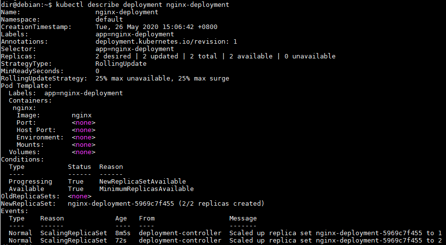

#### 命令行运行 nginx

##### 运行 deployment

```shell
$ kubectl create deployment nginx-deployment --image=nginx
deployment.apps/nginx-deployment created
```

##### 扩容 deployment

```shell
$ kubectl scale deployments/nginx-deployment --replicas=2
deployment.apps/nginx-deployment scaled
```

##### 查看 deployment 

```shell
$ kubectl get deployments
NAME               READY   UP-TO-DATE   AVAILABLE   AGE
nginx-deployment   2/2     2            2           7m43s
```

查看更详细信息

```shell
$ kubectl describe deployment nginx-deployment
```



##### 查看 replicaset

```shell
$ kubectl get rs
$ kubectl get replicaset
NAME                          DESIRED   CURRENT   READY   AGE
nginx-deployment-5969c7f455   2         2         2       9m25s
```

##### 查看 pod

```shell
$ kubectl get pod
NAME                                READY   STATUS    RESTARTS   AGE
nginx-deployment-5969c7f455-dcn65   1/1     Running   0          11m
nginx-deployment-5969c7f455-grp5s   1/1     Running   0          4m16s
```

查看 pod 详情

```shell
$ kubectl describe pod | egrep "^Name:|Controlled"
Name:         nginx-deployment-5969c7f455-dcn65
Controlled By:  ReplicaSet/nginx-deployment-5969c7f455
Name:         nginx-deployment-5969c7f455-grp5s
Controlled By:  ReplicaSet/nginx-deployment-5969c7f455
```

Controlled By 指明此 Pod 是由 `ReplicaSet/nginx-deployment-5969c7f455` 创建的。

##### 删除 deployment

```shell
$ kubectl delete deployment nginx-deployment
deployment.apps "nginx-deployment" deleted
```

#### 组件关系总结

1. 用户通过 kubectl 创建 Deployment（`deployments/nginx-deployment`）。
2. Deployment 创建 ReplicaSet（`ReplicaSet/nginx-deployment-5969c7f455`）。
3. ReplicaSet 创建 Pod（`nginx-deployment-5969c7f455-dcn65` 和 `nginx-deployment-5969c7f455-grp5s`）。


